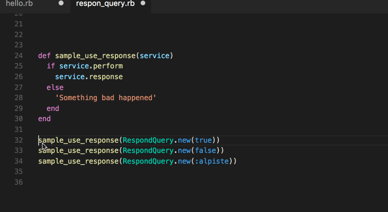

# RUBY-MARKERS

Visual Studio Code Extension to runs Ruby in the editor.




## Dependencies

**This extension only works in MAC OSX.**

You need xmpfilter to be installed. If you don't know if you have it installed, you can type this in your console:

```
$ xmpfilter -v
````

If you don't have it installed, you can install it via [rcodetools](https://github.com/JoshCheek/rcodetools). To install the gem type:

```
$ gem install rcodetools
```


## Usage

1. type # => in the line you want to print the sentence or press CMD+CTRL+m
2. press CMD+CTRL+e to execute the ruby code


## Contribute

[You can help in GitHub repository](https://github.com/artero/-ruby-marker)
